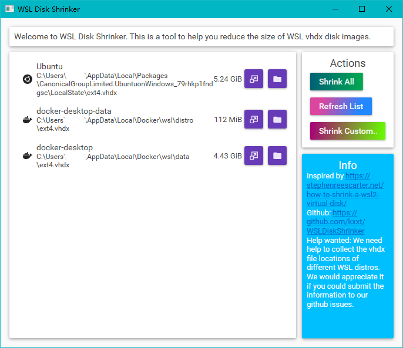
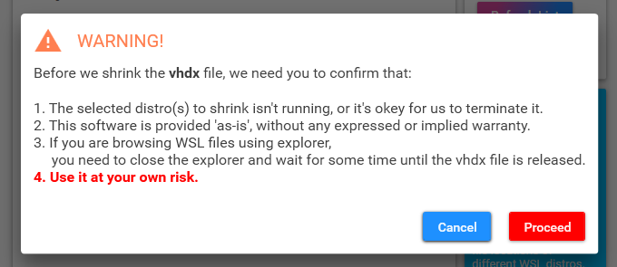

# WSL Disk Shrinker

Facing smaller and smaller C disk space ?  Growing WSL disk usage?

This is the right tool you are searching for!

This small tool can help you reduce the disk usage of WSL distros.

## Install

This application requires .net 6.0 or .net framework 4.7.2.

Download the latest version from `Release` page.

You can also install the app using [Chocolatey](https://community.chocolatey.org/packages/wsldiskshrinker):
```powershell
choco install wsldiskshrinker
```

## Usage

Open the application, you can see all your wsl distros.



For each distro , there are two buttons. 

- The first button will let you shrink it's disk.
- The second button will reveal the `.vhdx` file in the explorer.

You can shrink all distros in the list using the `Shrink All` button.

And you can select custom `.vhdx` file and shrink them using the `Shrink Custom...` button.

Before the actual work begins, you need to confirm the four points.



If you click the `Proceed` button, we will shrink the disk for you.


That's all. It's quite simple!
